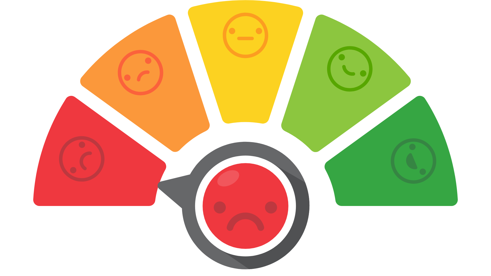
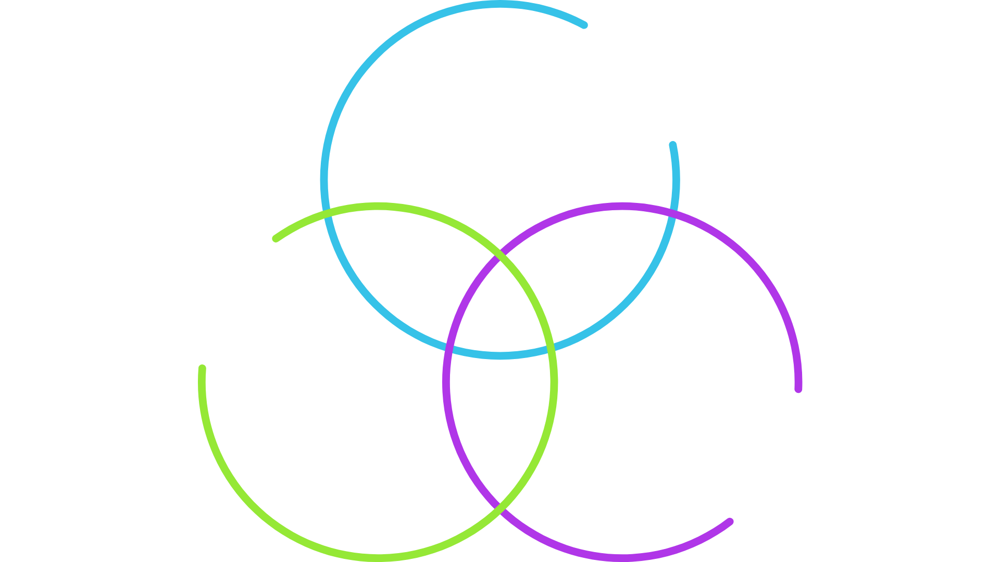

## Critical Path

Vikram Singh

University of Sherbrooke

February 24, 2024

### 💡 Topic

> Improving computer science students' ~~motivation~~ ability to provide quality peer code review through game-based learning.

<!--
Notes.
-->

### ⚠️ Problem

> Students give **poor feedback** during peer code reviews which is an **essential skill** for professional software developers.

<!--
- Peer code review is essential for software development, but it's only effective when students put in effort.
- This research investigates how to motivate CS students to provide high-quality feedback.
- Many Computer Science students find peer code review boring or pointless. This leads to superficial feedback that doesn't help anyone improve.
-->

### 🔍 Research Question

> Does a game-based learning approach, designed to increase computer science students' motivation, increase the quality of the feedback provided during peer code review?

<!--
Notes.
-->

### 🏗️ Conceptual Framework

<!--
- **Problem:** Traditional approaches to peer code review often fail to motivate Computer Science students, resulting in low-quality feedback that hinders learning for all involved.
- **Approach:** This research explores using game-based learning, informed by motivational theories, to increase student engagement with peer code review and improve the quality of feedback provided.
- **Potential Impact:** This study aims to benefit CS students by cultivating essential development skills, empower educators with effective strategies, and contribute to the broader understanding of motivation within computer science education.
-->

### 💭 Theoretical Frameworks

|Framework/Theory|Author|Concepts|
|:-|:-|:-|
|Self-Determination Theory| (Deci & Ryan 1994) | Intrinsic & extrinsic motivation |
|A RECIPE for Meaningful Gamification|(Nicholson 2015)| Meaning-based & rewards-based gamification|
|Peer Code Review Framework|(Indriasari 2023)|Criteria to assess code quality|
|Gamification Framework| (Ahmad et al. 2020) | Game design elements & learning outcomes|

<!--
- This research builds on the established value of peer code review, draws from key motivational theories, and explores successful uses of gamification and game-based learning in computer science education.
- **Ahmad et al.**:
	- gamification constructs
	- game design elements
	- assessment about students' satisfaction and learning outcomes
- **Nicholson**: Meaningful gamification is concerned about long-term benefits of gamification on the users. It aims to engage users by increasing their intrinsic motivation instead of using external rewards.
- **Deci & Ryan**: The basis of meaningful gamification is the Self-Determination Theory (SDT) which implies that intrinsic motivation is driven by: autonomy, competence or mastery, and relatedness.
	- Autonomy refers to freedom of choice;
	- competence refers to mastering learning material that would encourage user to engage deeper in the course activities;
	- relatedness represents social engagement and relations between participants.
-->

### 🔬 Preliminary Methodology

|Aspect|Description|
|:-|:-|
|Independent Variable| Game-based learning approach|
|Dependent Variable| Quality of code review feedback|
|Participants| 3rd year computer science students|
|Pre-test/Post-test| Measure code review quality _before_ introducing the game, then again _after_.|
|Intervention **(❓)**| A game-based learning experience about the per code review process. |
|Research Design| Group A gets intervention, group B does not, compare results. Afterwards, give intervention to group B for fairness.|
|Feedback Quality Assessment| Code feedback taxonomy (Hamer et al., 2015). |
|Data Analysis| Quantitative, statistical tests for comparing groups with pre/post scores, T-Test or Anova.|

<!--
- General comments were high-level and did not target particular elements of the code.
- Specific comments focused on some aspects of the code or criteria of code assessment.
- These two categories were further divided into negative, positive, neutral, and advice/action.
	- negative if it highlighted an aspect of the code that was inadequate
	- positive if it highlighted something that was completed well.
	- comments that were not obviously positive or negative in tone were classified as neutral.
	- Advice/action comments provided actionable suggestions for making modification or improvement to the programming code.
- Personal voice if they included personal features such as emoticon, encouragement, or directing a comment towards the author of the code rather than focusing on the code.
- Off-topic comments were unrelated to the project.
-->
